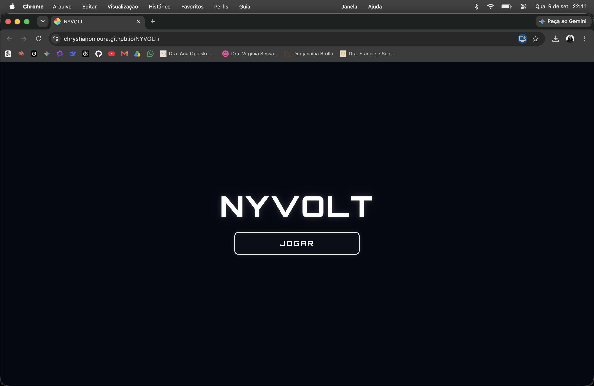
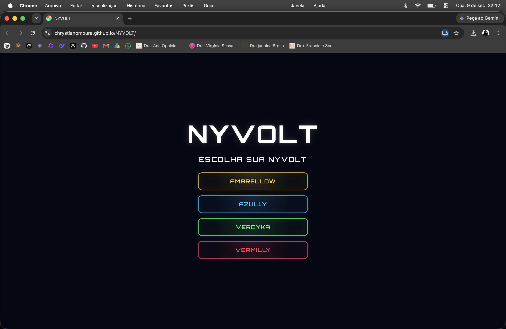
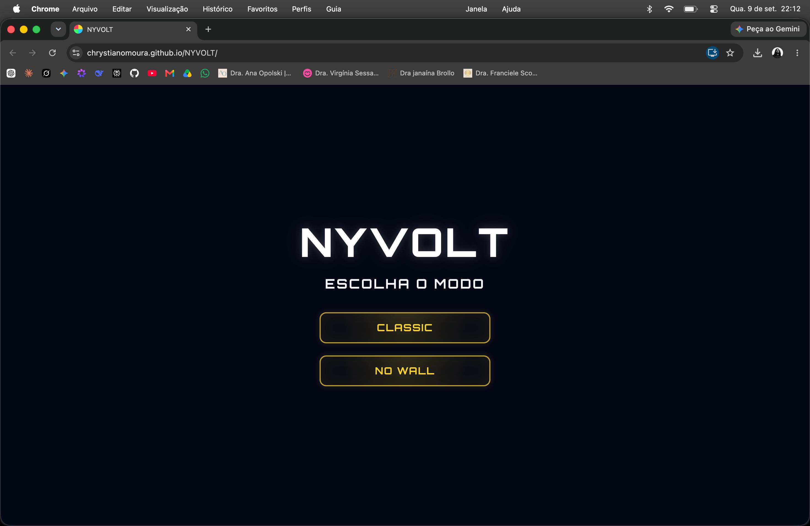
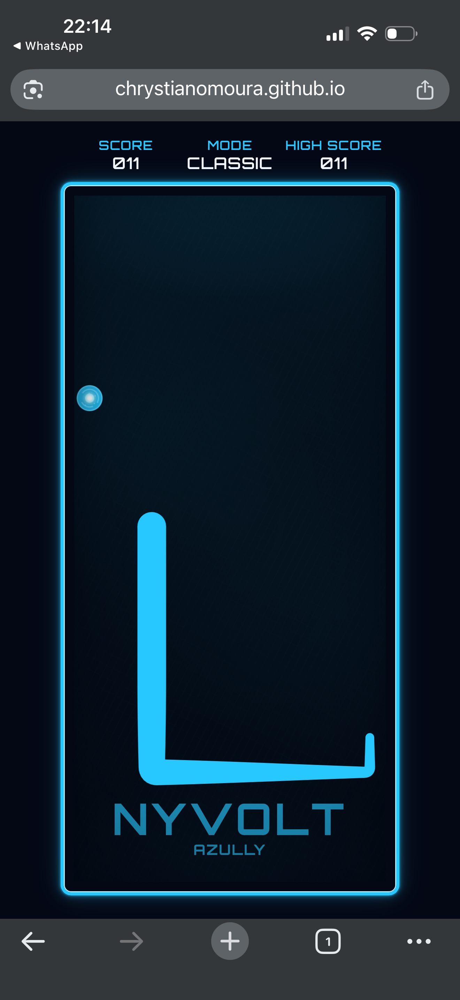
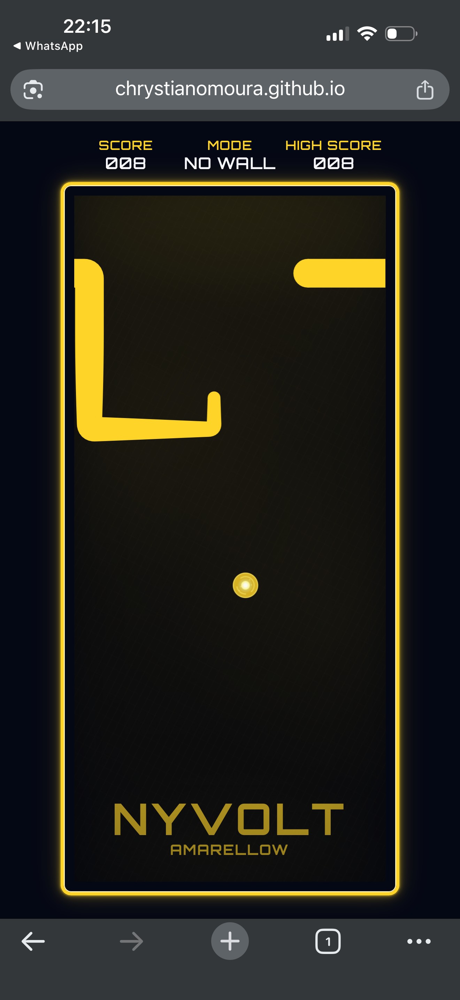
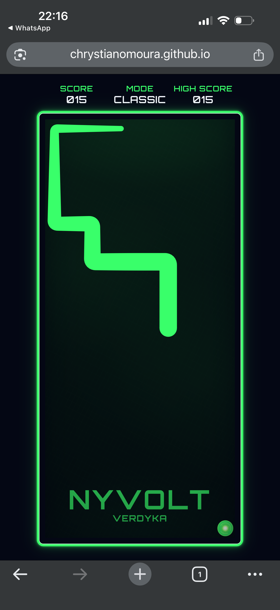
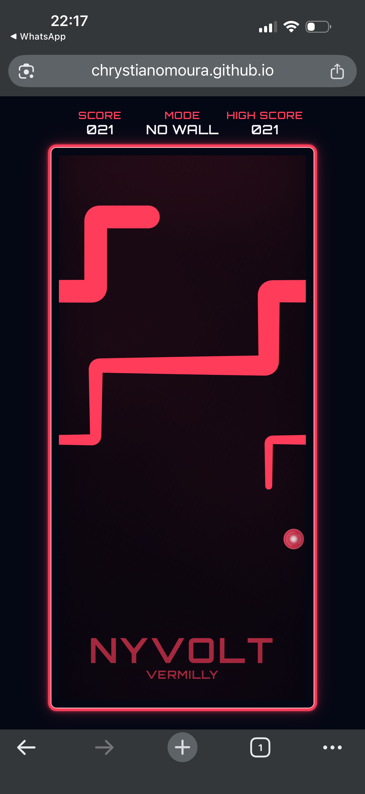

# NYVOLT

> **Um arcade inspirado na lógica de Snake, reconstruído como uma entidade contínua de energia: simulação discreta em grid, renderização interpolada em Canvas 2D, geometria própria e continuidade toroidal.**

<p align="center">
  <a href="https://chrystianomoura.github.io/NYVOLT/">
    <strong>⚡ JOGAR NYVOLT</strong>
  </a>
</p>

<p align="center">
  
  
  
  
  
  
  
</p>

<p align="center">
  
</p>

---

## Sobre o projeto

**NYVOLT** parte da regra fundamental de Snake — mover uma entidade por uma grade, coletar itens, crescer e evitar colisões — mas separa deliberadamente **simulação** e **apresentação**.

A engine trabalha em uma matriz de **10 × 22 células**, com posições inteiras e movimento determinístico. O jogador, porém, não vê blocos saltando entre células: entre dois estados lógicos, o renderer interpola a trajetória, preserva curvas ortogonais, arredonda mudanças de direção, calcula a superfície do corpo e mantém continuidade visual até durante a travessia das bordas no modo NO WALL.

```text
GRID DISCRETO
     │
     ▼
INTERPOLAÇÃO
     │
     ▼
CENTERLINE
     │
     ▼
CURVAS + SUPERFÍCIE
     │
     ▼
CANVAS 2D
```

A regra permanece discreta e previsível; o movimento percebido é contínuo.

### Destaques

- JavaScript Vanilla com **ES Modules**, sem framework ou dependências de runtime.
- Fixed timestep de **180 ms** independente do frame rate.
- Renderização interpolada em **Canvas 2D** sobre estado lógico discreto.
- Corpo vetorial construído com centerline, Béziers, normais e miter limitado.
- Continuidade toroidal no NO WALL sem interpolação através da arena.
- Crescimento lógico e crescimento visual tratados separadamente.
- Teclado e touch com proteção contra múltiplas mudanças por tick.
- Áudio procedural sintetizado com **Web Audio API**.
- High score persistente e independente por modo.
- Quatro identidades cromáticas: **AZULLY, VERDYKA, AMARELLOW e VERMILLY**.

---

## Identidade e gameplay

A NYVOLT não é desenhada como uma cobra segmentada com cabeça ou olhos. Ela é uma **entidade energética contínua**. Nos trechos técnicos deste documento, *cabeça* significa apenas a primeira posição lógica do array, não um componente visual separado.

| NYVOLT | Identidade |
| --- | --- |
| **AZULLY** | azul elétrico |
| **VERDYKA** | verde energético |
| **AMARELLOW** | amarelo luminoso |
| **VERMILLY** | vermelho intenso |

<p align="center">
  
</p>

A troca de identidade é propagada pelo evento `nyvolt:themechange`. CSS Custom Properties atualizam a interface, enquanto os renderizadores Canvas consultam as cores calculadas para manter arena, NYVOLT e orbe sincronizados.

A partida começa com **6 células**, movimento para baixo e um orbe posicionado em uma célula livre. Cada coleta soma `1` ao score, agenda uma unidade de crescimento, inicia o pulso energético e gera um novo orbe fora do corpo.

### Modos

**CLASSIC** — as bordas são paredes. Ultrapassar `x ∈ [0, 9]` ou `y ∈ [0, 21]` encerra a partida.

**NO WALL** — a arena é toroidal: atravessar uma borda faz a entidade reaparecer na borda oposta.

<p align="center">
  
</p>

Nos dois modos, a autocolisão encerra a partida.

### Gameplay em mobile

<table>
  <tr>
    <td align="center">
      <br>
      <strong>AZULLY · CLASSIC</strong>
    </td>
    <td align="center">
      <br>
      <strong>AMARELLOW · NO WALL</strong>
    </td>
  </tr>
  <tr>
    <td align="center">
      <br>
      <strong>VERDYKA · CLASSIC</strong>
    </td>
    <td align="center">
      <br>
      <strong>VERMILLY · NO WALL</strong>
    </td>
  </tr>
</table>

### Controles

No teclado, o jogo aceita **setas** e **WASD**. No touch, utiliza swipe contínuo.

A engine rejeita repetição da direção atual, inversão imediata de 180° e uma segunda mudança efetiva no mesmo tick. No touch, a primeira intenção exige **12 px**; uma troca de eixo exige **24 px** e predominância do novo eixo. Uma intenção válida que chega enquanto o tick está bloqueado pode permanecer em buffer para o próximo passo.

---

## Engenharia

### Fixed timestep e interpolação

A simulação avança a cada:

```text
MOVE_INTERVAL = 180 ms
```

ou aproximadamente **5,56 movimentos lógicos por segundo**.

`requestAnimationFrame()` não controla a velocidade da regra. Entre ticks, o renderer calcula:

\[
\alpha = \min\left(\frac{t-t_{ultimo}}{180},1\right)
\]

e interpola cada coordenada:

\[
P(\alpha)=P_0+(P_1-P_0)\alpha
\]

Assim, a engine continua avançando exatamente uma célula por tick, enquanto o Canvas produz as posições intermediárias. Se um frame atrasar, o loop executa em `while` os ticks completos pendentes antes de renderizar o progresso restante.

A aplicação mantém separadamente o estado lógico atual, o estado visual e a fotografia visual anterior. Essa fronteira permite resolver interpolação, crescimento e wrap sem alterar as regras de colisão.

---

### A matemática do NO WALL

#### Normalização modular

Para uma dimensão `n`, posições externas são normalizadas por:

\[
wrap(v,n)=((v\bmod n)+n)\bmod n
\]

Logo:

```text
x = 10  → 0
x = -1  → 9
y = 22  → 0
y = -1  → 21
```

O segundo módulo corrige o fato de `%` em JavaScript poder produzir resto negativo.

#### Continuidade visual

Normalizar a lógica não resolve a renderização. Se a NYVOLT atravessa a direita:

```text
anterior: x = 9
atual:    x = 0
```

interpolar `9 → 0` faria a entidade cruzar visualmente a arena inteira. Para o renderer, `0` precisa ser interpretado como sua cópia periódica equivalente `10`.

A continuidade escolhe a cópia virtual mais próxima da referência `r`. Primeiro:

\[
n=wrap(v,s)
\]

depois:

\[
k=round\left(\frac{r-n}{s}\right)
\]

e:

\[
v'=n+ks
\]

Esse *lift* é aplicado sequencialmente ao corpo, sempre tomando como referência o ponto anterior já resolvido. A centerline pode então permanecer contínua mesmo quando o estado lógico está dividido entre lados opostos da matriz.

Quando parte do corpo ultrapassa o retângulo principal, o renderer desenha somente as cópias periódicas necessárias:

\[
(x',y')=(x+10k_x,\ y+22k_y)
\]

Isso preserva a topologia toroidal sem alterar as coordenadas armazenadas pela engine.

---

### Da grade ao corpo contínuo

Cada célula lógica `{x, y}` é convertida para seu centro geométrico:

\[
C_x=x+0.5,\qquad C_y=y+0.5
\]

A largura base do corpo é **0,92 célula**, mantendo toda a geometria independente da resolução física da tela.

#### Centerline e cauda

A representação começa por uma **centerline**: a cabeça é interpolada, pontos redundantes são removidos e sequências colineares são simplificadas antes da construção do contorno.

A cauda exige tratamento específico. Ao passar por um canto, interpolar diretamente suas coordenadas poderia criar uma diagonal que nunca existiu na trajetória lógica. O caminho é reconstruído pelo canto ortogonal e medido por distância Manhattan:

\[
d(A,B)=|x_B-x_A|+|y_B-y_A|
\]

Assim, a extremidade percorre a trajetória real do corpo.

#### Curvas

Mudanças ortogonais recebem Béziers quadráticas. O raio nominal é **0,18 célula**, limitado também a `32%` dos segmentos de entrada e saída:

\[
r_{disp}=\min(0.32L_{entrada},\ 0.32L_{saida})
\]

A curva segue:

\[
B(t)=(1-t)^2P_0+2(1-t)tP_1+t^2P_2,\qquad 0\le t\le1
\]

Cada curva mantém amostras de comprimento para permitir consultas por distância ao longo da trajetória, em vez de depender apenas do parâmetro `t`.

#### Superfície

Entre pontos consecutivos, a geometria calcula a direção normalizada:

\[
\hat d=\frac{(\Delta x,\Delta y)}
{\sqrt{\Delta x^2+\Delta y^2}}
\]

e sua normal:

\[
n=(-d_y,d_x)
\]

A normal e a largura local geram as bordas esquerda e direita. Nas junções, normais adjacentes são combinadas com **miter limitado a `1.35`**, evitando pontas excessivas. A superfície é fechada pelas duas bordas e por caps circulares nas extremidades.

---

### Crescimento e morfologia

Cada coleta agenda **uma unidade lógica** de crescimento. No deslocamento seguinte, a posição anterior da cauda é preservada, aumentando o corpo em exatamente uma célula.

Esse crescimento não aparece instantaneamente. Um offset visual é liberado ao longo de **7 ticks**, com passo:

\[
\Delta g=\frac{1}{7}
\]

Isso evita saltos na extremidade.

A morfologia acumulada também é suavizada no tempo:

\[
a=1-e^{-\Delta t/360}
\]

\[
g_{novo}=g_{atual}+(g_{alvo}-g_{atual})a
\]

com `Δt` limitado a **50 ms**.

A contribuição do crescimento para o perfil é:

\[
w_g=\frac{g^2}{g+2}
\]

e a largura da ponta:

\[
w_{ponta}=\max(0.28,\ 0.92-0.08w_g)
\]

Na região de taper:

\[
t=p^2(2-p)
\]

A cauda, portanto, muda de forma continuamente conforme o crescimento acumulado, em vez de atribuir larguras arbitrárias a segmentos individuais.

---

### Orbe e absorção de energia

O orbe é desenhado em Canvas, sem imagens externas. Ele combina corpo radial, núcleo, anel, **5 partículas orbitais**, pulsação e rotação. O raio principal ocupa `39%` da menor dimensão disponível.

A pulsação depende diretamente do timestamp:

\[
p=\frac{\sin(0.0042t)+1}{2}
\]

e a rotação:

\[
\theta=0.0018t
\]

Para o spawn, a engine percorre as **220 células** da arena, remove as ocupadas e sorteia exclusivamente entre as restantes.

A absorção possui uma timeline de **480 ms**:

```text
0 ms ───── 90 ms ── 150 ms ───────────── 480 ms
 │           │          │                    │
 │  subida   │  hold    │       queda        │
 ▼           ▼          ▼                    ▼
 0           1          1                    0
```

Subida e queda usam:

\[
S(p)=3p^2-2p^3
\]

Durante o pulso, a cor base é misturada até **32% em direção ao branco**, mantendo o efeito dentro da superfície da NYVOLT. A remoção visual do orbe é sincronizada com o início desse contato energético.

---

### Colisões

No CLASSIC, há colisão de parede quando:

\[
x<0\ \lor\ x\ge10\ \lor\ y<0\ \lor\ y\ge22
\]

No NO WALL, a mesma posição é normalizada.

Na autocolisão, a posição futura da cabeça é comparada ao próprio corpo. A cauda exige uma regra adicional: sem crescimento, sua célula será liberada naquele tick e pode deixar de bloquear a próxima posição; com crescimento pendente, ela permanece ocupada.

Essa distinção permite entrar legitimamente na célula que a cauda está abandonando sem mascarar uma colisão real quando ela permanecerá no corpo.

---

### Canvas, resolução e responsividade

O Canvas adapta seu buffer ao tamanho físico do elemento e ao `devicePixelRatio`, mas transforma o contexto para continuar operando em **10 × 22 unidades lógicas**. Um `ResizeObserver` recalcula o buffer quando a camada muda de tamanho.

A geometria, portanto, continua expressa em células; somente sua projeção final depende dos pixels disponíveis.

O CSS usa Custom Properties, `clamp()`, unidades relativas à viewport, Grid/Flexbox e media queries. Em dispositivos touch compatíveis, a Screen Orientation API é usada de forma não destrutiva para tentar preservar portrait.

---

### Áudio, score e persistência

Todos os efeitos são sintetizados em runtime com **Web Audio API**. `OscillatorNode`, `GainNode`, envelopes, sweeps de frequência, ruído, filtros e sequências de notas produzem feedback para menu, direção, coleta, high score, colisão, reinício, saída e game over. Não há arquivos de áudio externos.

CLASSIC e NO WALL mantêm recordes independentes em `localStorage`:

```text
nyvolt-high-score-classic
nyvolt-high-score-no-wall
```

O score é exibido com três dígitos. A primeira partida de cada modo estabelece a referência silenciosamente; nas seguintes, o feedback de recorde ocorre uma única vez quando o score ultrapassa o high score existente no início da rodada.

---

## Arquitetura

O projeto usa ES Modules nativos e separa regra, geometria, interface e áudio.

```text
                         ┌──────────────────┐
                         │    script.js     │
                         │   orquestração   │
                         └────────┬─────────┘
                                  │
              ┌───────────────────┼───────────────────┐
              ▼                   ▼                   ▼
          js/game/            js/snake/           js/audio/
        regra/estado          geometria              som
              │                   │
              └──────────────┐    ▼
                             └─► Canvas 2D
```

`script.js` conecta DOM, estado, input, score, áudio, orbe, renderer e loop. `js/game/` concentra regras e controladores; `js/snake/`, a transformação geométrica do estado discreto em corpo contínuo.

### Fluxo de um tick

```text
requestAnimationFrame
        │
        ▼
tick de 180 ms completo?
        │
       SIM
        ▼
aplica direção em fila
        │
        ▼
calcula próxima posição
        │
        ▼
resolve CLASSIC / NO WALL
        │
        ├── parede ─────────────► GAME OVER
        ▼
verifica orbe e autocolisão
        │
        ├── autocolisão ────────► GAME OVER
        ▼
score + crescimento + áudio
        │
        ▼
fotografa estado visual
        │
        ▼
move + aplica crescimento
        │
        ▼
renderer interpola até o próximo tick
```

### Pipeline gráfico

```text
estado atual + anterior + α
           │
           ▼
continuidade virtual
           │
           ▼
interpolação
           │
           ▼
centerline
           │
           ▼
simplificação + Béziers
           │
           ▼
amostragem por distância
           │
           ▼
morfologia + largura
           │
           ▼
direções + normais + miter
           │
           ▼
superfície + caps
           │
           ▼
projeções de wrap
           │
           ▼
Canvas 2D
```

Para a engine, apesar de todo esse pipeline, a NYVOLT continua sendo essencialmente um array de posições inteiras.

### Módulos

| Área | Responsabilidade |
| --- | --- |
| `js/script.js` | orquestração geral da aplicação |
| `js/game/` | estado, movimento, colisão, modos, crescimento, loop, score, spawn e telas |
| `js/snake/` | centerline, continuidade, curvas, amostragem, morfologia e superfície |
| `js/input.js` | teclado, touch, lock por tick e buffer de intenção |
| `js/orb.js` | renderização procedural do orbe |
| `js/audio/sound.js` | síntese e estado global do áudio |
| `css/` | sistema visual, temas, HUD, arena, overlays e responsividade |

---

## Acessibilidade e identidade do navegador

A interface utiliza controles `button`, grupos semânticos, `aria-pressed`, nomes acessíveis para arena/NYVOLT/orbe, região `aria-live="assertive"` no game over, diálogo com `aria-modal` e suporte a teclado. Elementos puramente decorativos são ocultados de tecnologias assistivas quando apropriado.

O projeto inclui favicon SVG/ICO/PNG, Apple Touch Icon, ícones `192×192` e `512×512`, versões `maskable` e `site.webmanifest` com `start_url`, `scope`, cores e `display: standalone`.

Não há Service Worker; portanto, o manifest fornece identidade e metadados de instalação, **não suporte offline**.

---

## Tecnologias

**HTML5** — estrutura semântica, HUD, controles, overlays, ARIA, metadados e manifest.

**CSS3** — layout, temas, Custom Properties, responsividade, `clamp()`, transições e animações.

**JavaScript Vanilla / ES Modules** — engine, estado, fixed timestep, input, colisões, crescimento, persistência, eventos e orquestração.

**Canvas 2D API** — NYVOLT e orbe, geometria vetorial, curvas, gradientes, partículas, transformações, DPR e wrap.

**Web Audio API** — síntese procedural de efeitos com osciladores, envelopes, filtros, ruído e sequências de frequências.

Outras APIs nativas utilizadas incluem `requestAnimationFrame()`, `performance.now()`, `ResizeObserver`, `CustomEvent`, `localStorage` e, quando disponível, Screen Orientation API.

---

## Estrutura

```text
NYVOLT/
├── assets/
│   ├── icons/
│   └── screenshots/
├── css/
│   ├── base.css
│   ├── board.css
│   ├── countdown.css
│   ├── game-over.css
│   ├── main.css
│   ├── orb.css
│   ├── start-screen.css
│   └── themes.css
├── js/
│   ├── audio/
│   │   └── sound.js
│   ├── game/
│   │   ├── board-position.js
│   │   ├── collision.js
│   │   ├── config.js
│   │   ├── direction.js
│   │   ├── game-over.js
│   │   ├── growth.js
│   │   ├── loop.js
│   │   ├── mode.js
│   │   ├── movement.js
│   │   ├── orb-spawn.js
│   │   ├── orientation.js
│   │   ├── score.js
│   │   ├── start-screen.js
│   │   ├── state.js
│   │   └── theme.js
│   ├── snake/
│   │   ├── body.js
│   │   ├── canvas.js
│   │   ├── centerline.js
│   │   ├── continuity.js
│   │   ├── energy.js
│   │   ├── geometry.js
│   │   ├── morphology.js
│   │   ├── path-sampling.js
│   │   ├── rounded-path.js
│   │   ├── tail-path.js
│   │   └── wrap.js
│   ├── input.js
│   ├── orb.js
│   ├── script.js
│   └── snake.js
├── .gitignore
├── index.html
├── site.webmanifest
└── README.md
```

---

## Como executar

O projeto não possui processo de build nem dependências de runtime.

```bash
git clone https://github.com/chrystianomoura/NYVOLT.git
cd NYVOLT
python3 -m http.server 8000
```

Depois acesse `http://localhost:8000`.

Também é possível utilizar um servidor HTTP local equivalente, como o Live Server do VS Code. Como a aplicação utiliza ES Modules, servir os arquivos por HTTP evita limitações do protocolo `file://`.

**Versão publicada:** https://chrystianomoura.github.io/NYVOLT/

---

## Decisões técnicas

| Problema | Decisão |
| --- | --- |
| Movimento em grid parecia rígido | Fixed timestep + interpolação visual |
| Frame rate variável poderia alterar a regra | Tick fixo de 180 ms com catch-up |
| Wrap `9 → 0` atravessava visualmente a arena | Cópia periódica virtual mais próxima |
| Corpo precisava aparecer nos dois lados do wrap | Projeções apenas dos tiles necessários |
| Segmentos discretos não formavam corpo contínuo | Centerline + superfície vetorial |
| Curvas de 90° eram rígidas | Bézier quadrática com raio adaptativo |
| Cauda podia cortar curvas em diagonal | Caminho ortogonal + distância Manhattan |
| Crescimento lógico causava salto | Liberação visual progressiva da cauda |
| Cauda precisava evoluir com o tamanho | Morfologia temporal + taper contínuo |
| Junções podiam formar pontas | Miter limitado a `1.35` |
| Orbe poderia nascer sobre o corpo | Sorteio apenas entre células livres |
| Coleta precisava de feedback integrado | `smoothstep` + mistura interna de cor |
| Canvas precisava permanecer nítido | DPR + coordenadas lógicas |
| Touch podia gerar duas curvas no mesmo tick | Lock + buffer de intenção |
| Modos representam desafios diferentes | High scores independentes |
| Áudio não precisava de assets | Síntese procedural com Web Audio API |

---

## Invariantes

Independentemente de frame rate, tela ou tema:

1. A engine opera em uma grade **10 × 22**.
2. Cada tick move a cabeça lógica exatamente uma célula em um dos quatro eixos.
3. A direção não pode inverter 180°.
4. O orbe nunca nasce em uma célula ocupada.
5. Cada coleta adiciona exatamente uma unidade lógica ao corpo.
6. CLASSIC trata o exterior como parede.
7. NO WALL normaliza o exterior para a borda oposta.
8. Coordenadas virtuais de renderização nunca alteram as posições lógicas.
9. Frame rate altera apenas a quantidade de estados visuais intermediários.
10. Os high scores dos modos são independentes.

Essas invariantes delimitam **o que o jogo é** e **como ele é desenhado**.

---

## Aprendizados

NYVOLT começou com uma regra conhecida, mas seus problemas mais interessantes surgiram quando a representação deixou de ser uma sequência de blocos.

Transformar posições discretas em um corpo contínuo exigiu separar **tempo, topologia, trajetória e superfície**. A interpolação resolveu o intervalo entre ticks, mas expôs o problema do wrap. O wrap lógico resolveu a posição, mas exigiu um espaço virtual contínuo para a renderização. A centerline resolveu a trajetória, mas ainda precisou ser arredondada, amostrada e convertida em superfície. O crescimento funcionava na engine, mas precisou de uma representação própria para não quebrar a continuidade da cauda.

O princípio técnico que atravessa o projeto é simples:

> **estado de simulação e estado de apresentação não precisam ser a mesma coisa.**

A engine pode permanecer discreta e determinística enquanto o renderer interpreta esse estado por interpolação, geometria vetorial e animação temporal. Essa separação preservou a regra reconhecível de Snake e, ao mesmo tempo, permitiu construir uma identidade visual e técnica própria para NYVOLT.

<p align="center">
  <a href="https://chrystianomoura.github.io/NYVOLT/">
    <strong>⚡ JOGAR NYVOLT</strong>
  </a>
</p>